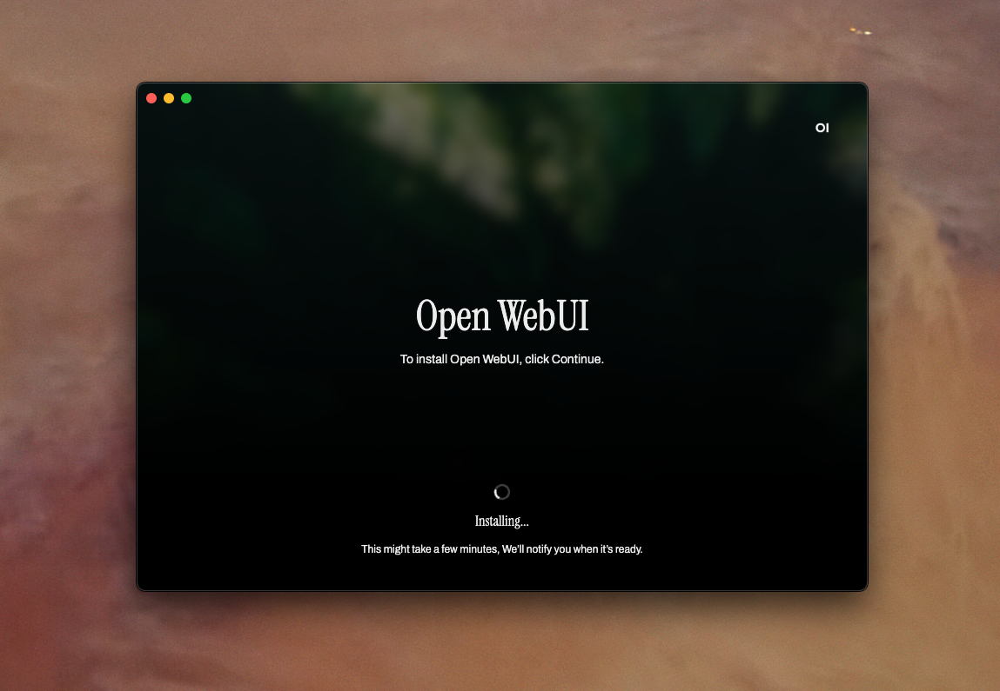

# Open WebUI Desktop 🌐

**Open WebUI App** is the cross-platform desktop application for [Open WebUI](https://github.com/open-webui/open-webui). It brings the _full-featured Open WebUI experience_ directly to your device, effectively transforming it into a powerful server—without the complexities of manual setup.

This project is currently in **alpha** and under active development. 🛠️ Expect frequent updates and potential changes as we refine the application.

## Download 📥
Get the latest alpha release from our [releases page](https://github.com/open-webui/desktop/releases).

**Note**: An internet connection is required for initial setup, but afterwards the application can be used completely offline.

## Features
- **One-Click Installation**: Quickly and effortlessly install and set up Open WebUI with all its dependencies. This feature is fully functional and ready to make your setup a breeze.
- **Cross-Platform Support**: Compatible with Windows, macOS, and Linux to ensure broad accessibility.
- **Offline Capability**: After initial setup, use the application completely offline for enhanced privacy and reliability.

## Project Setup
### Install
```bash
npm install
```
### Development
```bash
npm run dev
```
### Build
```bash
# For windows
npm run build:win
# For macOS
npm run build:mac
# For Linux
npm run build:linux
```
## License 📜
This project is licensed under the **Open WebUI Sustainable Use License**. For details, see [LICENSE](LICENSE).
## Stay Tuned! 🌟
We're actively developing Open WebUI App. Follow [Open WebUI](https://github.com/open-webui/open-webui) for updates, and join the [community on Discord](https://discord.gg/5rJgQTnV4s) to stay involved.